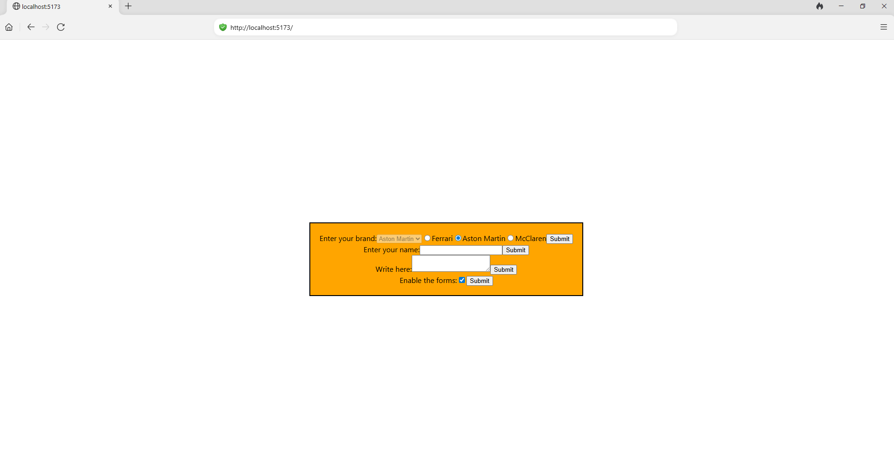

**Note that the instructions below are based on W3School's React tutorial (https://www.w3schools.com/react).**

To run the React website in this repo, follow the instructions below:

1. If necessary, download the latest version of Node.js, which should also install the npm build tool.

2. Install the Vite build tool with the following command:

 `npm install -g create-vite`

3. Create your React application react-app-name with the following command:

`npm create vite@latest react-app-name -- --template react`

For reference, `react-app-name` will be the base folder for your application, so you can change its name as you prefer.

4. In the terminal, navigate to a separate folder, and clone this repository to the folder with the following command:

`git clone https://github.com/Irving7954/React-Vite-Application`

5. In your base folder, replace the `src` folder's contents with the contents of the the GitHub repository's `src` folder.

6. In the terminal, go to the base folder, and run the following command:

`npm run dev`

7. Go to http://localhost:5173/ to view the expected website with highlighted forms:

